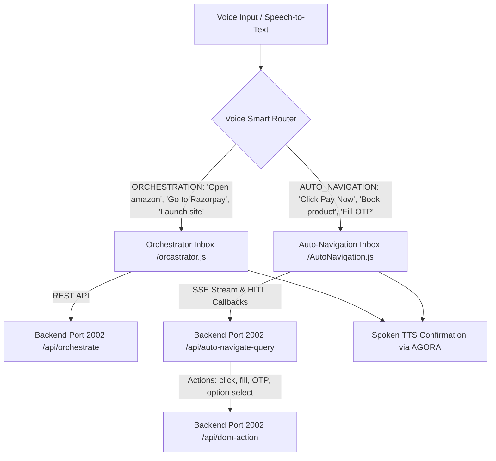

# Voice Agent Panel & Voice Smart Router (For_Rpay)

This folder contains the complete **Voice Agent Panel** with the **Voice Smart Router & Intent Navigator**, adapted and configured so you can drop it directly into your Razorpay or other target projects.

---

## 🎯 Architecture & How the Smart Router Works

When the user speaks into the microphone (or submits text), the **Voice Smart Router** automatically classifies the query's intent and directs it to the appropriate execution engine:



### 1. Intent Classification
- **LLM-Powered Classification**: Uses `meta/llama-3.1-8b-instruct` via Nvidia NIM to categorize queries into:
  - `ORCHESTRATION`: Top-level website navigation or launching tasks (e.g., *"open razorpay checkout"*, *"go to youtube"*, *"search flipkart"*).
  - `AUTO_NAVIGATION`: In-page interaction, form filling, booking, and checkout (e.g., *"click pay now"*, *"book this product"*, *"select standard shipping"*).
- **Zero-Latency Fallback**: If offline or LLM fails, a heuristic keyword matching engine instantly routes the command without blocking.

### 2. Human-In-The-Loop (HITL) Automation
- When `AutoNavigation` encounters a sensitive or ambiguous step:
  - **OTP Verification**: Triggers an interactive OTP popup in the Voice UI, waits for the user code, and resumes automation.
  - **Option Select**: Prompts the user with dynamic choice buttons in the Voice UI.
  - **Task Completion Modal**: Shows a confirmation when payment or booking finishes.

---

## 📁 File Structure

| File | Description |
|---|---|
| `voice_server.js` | Express server (Port `2003`) serving the WebRTC voice dashboard UI, API endpoints for STT, TTS, token building, and SSE streaming. |
| `RouterLogic.js` | Core classification & dispatch logic (`routeVoiceQuery`, `classifyQuery`). |
| `AutoNavigation.js` | In-page loop runner with HITL OTP and option select callback support. |
| `orcastrator.js` | Multi-step URL and workflow orchestrator. |
| `LLM_FOR_VOICE.js` | LLM conversation helper generating concise 1-sentence spoken responses. |
| `Text-To-Speech.js` | Multi-tier TTS engine (Resemble.AI, Local NIM, NVCF, and Google Translate TTS fallback). |
| `AGORAChannel.js` | Client script to connect to Agora RTC channel with dynamic token. |
| `PublishAUDIO.js` | Client script to publish local microphone track. |
| `initilizing_Voice.js` | Client script to initialize Agora RTC client. |
| `voice_capturing.js` | Client script to capture local microphone stream. |
| `CleanupStop.js` | Client script to stop audio streams and disconnect. |
| `receiver.html` | Headless Agora receiver HTML for recording audio in background. |

---

## ⚙️ Environment Configuration

Set the following in `.env` (or let it fall back to workspace defaults):

```env
VOICE_PORT=2003
BACKEND_URL=http://localhost:2002
AGORA_APP_ID="<your-agora-app-id>"
AGORA_APP_CERTIFICATE="<your-agora-app-certificate>"
AGORA_CHANNEL="demo-channel"
NVIDIA_API_KEY="<your-nvidia-api-key>"
```

---

## 🚀 How to Run

1. Make sure required dependencies are installed:
   ```bash
   npm install express cors agora-token agora-rtc-sdk-ng openai @playwright/test
   ```
2. Start the Voice Server:
   ```bash
   node For_Rpay/voice_server.js
   ```
3. Open your browser at:
   ```
   http://localhost:2003
   ```
4. Toggle **🧠 VOICE SMART ROUTER** to **ON** in the panel to enable automatic intent-based routing.
