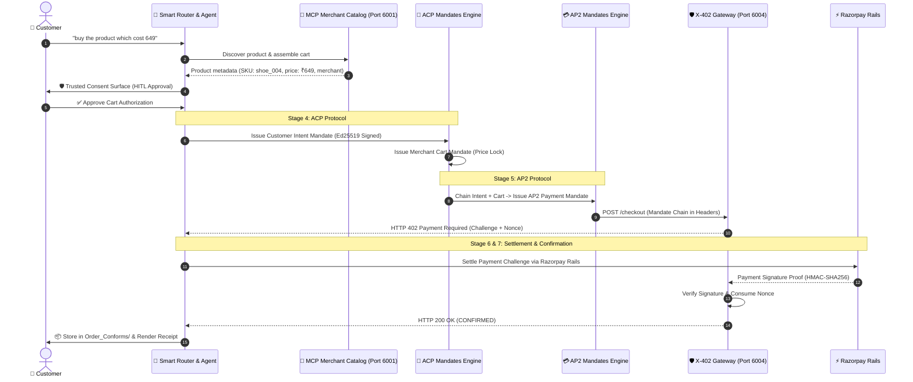

# ⚡ Razorpay Autonomous Agentic Commerce: ACP, AP2 & X-402

An end-to-end implementation of **Autonomous Agentic Commerce** integrating **Agentic Commerce Protocol (ACP)**, **Agent Payment Protocol (AP2)**, and **HTTP X-402 Payment Required Gateway** on top of the **Razorpay Payment Infrastructure**.

---

## 🏗️ Core Protocol Architecture



---

## 🌟 The Three Pillars: ACP, AP2 & X-402

### 1. 📜 **ACP (Agent Commerce Protocol)**
- **Autonomous Discovery**: Autonomous element resolution over Model Context Protocol (MCP).
- **Trusted Consent Surface**: Mandatory human-in-the-loop authorization modal before committing funds.
- **Intent & Cart Mandates**: Cryptographically generates `IntentMandate` (user authorization limit) and `CartMandate` (merchant SKU & price guarantee).

### 2. 💳 **AP2 (Agent Payment Protocol)**
- **Mandate Chaining**: Cryptographic parent-child link: `IntentMandate` ➔ `CartMandate` ➔ `PaymentMandate`.
- **Spend Constraints**: Verifies cart amount does not exceed intent spend limits.
- **Anti-Tamper Digital Signatures**: Ed25519 asymmetric signatures guaranteeing non-repudiation.

### 3. 🛡️ **X-402 (HTTP 402 Gateway Rail)**
- **Standardized Machine Payments**: Gateway returns `HTTP 402 Payment Required` with anti-replay challenge nonces.
- **Razorpay Rails Settlement**: Validates payment proof using genuine Razorpay HMAC-SHA256 signature verification.
- **Order Conformation (`Order_Conforms/`)**: Stores full confirmed order manifests including item specs, payment IDs, and cryptographic hashes.

---

## 🔄 7-Stage Autonomous Lifecycle

| Stage | Name | Description | Status Rail |
| :---: | :--- | :--- | :---: |
| **1** | **Query Asked** | Voice / Text natural language query ingested | 🔵 Active |
| **2** | **Discovery** | MCP tool server resolves target item and price | 🟢 Resolved |
| **3** | **Consent** | Trusted Consent Surface provides human authorization | 🛡️ HITL |
| **4** | **ACP Mandates** | Generates signed Customer Intent & Merchant Cart Mandates | 📜 ACP |
| **5** | **AP2 & X-402** | Issues AP2 Payment Mandate & receives HTTP 402 Challenge | 💳 AP2 |
| **6** | **Razorpay Payment** | Settles payment via Razorpay Test Rails | ⚡ Razorpay |
| **7** | **Confirmed** | Order confirmed, receipt issued, saved to `Order_Conforms/` | ✅ Confirmed |

---

## 🖥️ Microservices & Ports

| Service | Port | Description |
| :--- | :---: | :--- |
| **Voice & Smart Router Dashboard** | `6003` | Main dashboard, 7-stage tracker, mandate drawer & **Confirmed Orders Cart** |
| **AP2 / X-402 Tracing Visualizer** | `6003/tracing` | Real-time SSE cryptographic trace inspector |
| **X-402 Gateway & AP2 Engine** | `6004` | HTTP 402 challenge handler & cryptographic verifier |
| **MCP Tool Server** | `6001` | Merchant catalog tool server for autonomous agents |
| **React Storefront** | `5173` | Razorpay ACP Storefront (Vite + React) |
| **Playwright Automation** | `5000` | Headed browser controller and automation panel |

---

## 🚀 Quick Start

### 1. Install Dependencies
```bash
npm install
cd my-react-app && npm install && cd ..
```

### 2. Start All Services
```bash
# Windows
start_all.bat

# Or run with Node runner
node server_runner.js
```

### 3. Execute Autonomous Purchase
1. Navigate to **`http://localhost:6003`**.
2. Click **`👟 Buy Sneaker (₹649)`** and click **Execute `➔`**.
3. Approve the cart on the **🛡️ Trusted Consent Surface**.
4. Complete settlement on the **X-402 Payment Challenge**.
5. View the confirmed order in the **`🛍️ Confirmed Orders Cart`**.

---

## 🧪 Testing

Run the end-to-end cryptographic test suite:
```bash
node X402_GateWay/tests/x402_mandate.test.js
```
Expected output: `📊 TEST RESULTS: 14 PASSED | 0 FAILED`.
