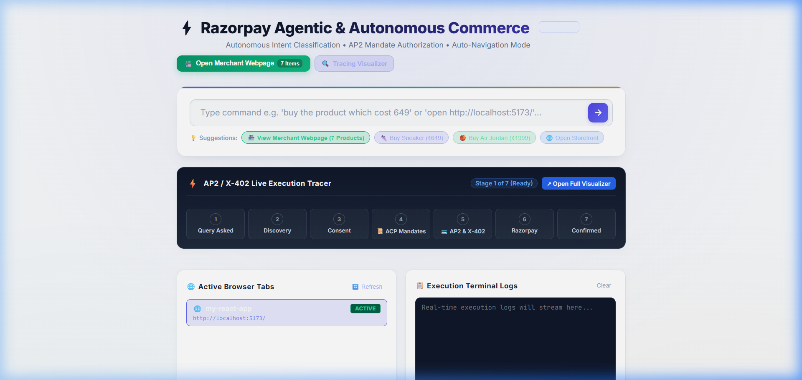

# 🏪 Razorpay ACP Merchant Storefront (React + Vite)

<div align="center">

[](https://razor-pay-submission.vercel.app/)
[](https://razor-pay-submission.vercel.app/tracing)

### 🌐 **[👉 CLICK HERE TO OPEN LIVE STORE & DASHBOARD 👈](https://razor-pay-submission.vercel.app/)**
**⚡ Production App:** [https://razor-pay-submission.vercel.app/](https://razor-pay-submission.vercel.app/)

</div>

---

## 📐 Autonomous Protocol Execution Flowchart

<div align="center">
  
</div>

---

## 🛍️ Overview
This storefront represents the **Merchant Layer** in the Razorpay Agentic Commerce Protocol (ACP) ecosystem:
* **Structured Catalog Feed**: Exposes machine-readable products (Air Jordan, Chunky Sneakers, Retro Green Sneakers, Trail Runners).
* **Agentic Cart Building**: Interacts with autonomous agents via ACP endpoints and MCP tool discovery.
* **AP2 & X-402 Compatibility**: Integrates seamlessly with Razorpay payment challenge rails.

---

## 🚀 Running Locally
```bash
npm install
npm run dev
```
Runs at `http://localhost:5173/`.
